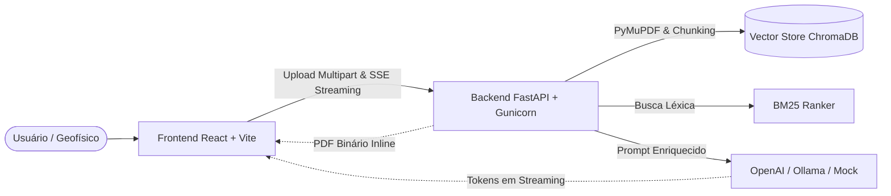

# 🌍 GeoDoc AI — Plataforma de RAG para Relatórios Geofísicos e Técnicos

[](https://opensource.org/licenses/MIT)
[](https://fastapi.tiangolo.com)
[](https://react.dev)
[](https://www.typescriptlang.org)
[](https://www.docker.com)

**GeoDoc AI** é uma aplicação Fullstack de alta performance projetada para equipes de engenharia, geociências e geofísica. Ela permite carregar relatórios técnicos complexos (dados sísmicos 3D, perfis de poço, reservatórios e estudos ambientais) e realizar consultas semânticas utilizando **IA Generativa** e **RAG Híbrido (Retrieval-Augmented Generation)** com citação auditável de fontes por página, visualizador de PDF lado a lado integrado e streaming em tempo real.

---

## 📸 Funcionalidades Principais

* **⚡ Chat com Streaming em Tempo Real (SSE):** Efeito de digitação contínuo via *Server-Sent Events* consumindo modelos da OpenAI ou instâncias locais do Ollama com latência zero.
* **📑 RAG Híbrido com Citação de Fontes:** Combina busca vetorial por cosseno (**ChromaDB**) e ranking léxico (**BM25**) para encontrar conceitos geológicos e identificadores de poços exatos.
* **🔍 Visualizador de PDF Lado a Lado:** Clique na página citada pela IA (*"Pág. 2"*) e o PDF original abre instantaneamente ao lado do chat na página correta.
* **📂 Ingestão com PyMuPDF & Chunking Semântico:** Extração geométrica por blocos de texto (`fitz`), preservando colunas múltiplas e tabelas técnicas sem quebrar sentenças.
* **🎯 Filtro de Escopo por Relatório:** Permite alternar entre consultar toda a base de relatórios ou isolar a consulta a um único documento técnico selecionado.
* **🛡️ Arquitetura Resiliente & Modo Mock:** Opera com OpenAI, Ollama ou em modo Mock (100% offline e sem custos de API) para testes rápidos e demonstrações.
* **🐳 Docker Compose Unificado:** Ambiente de produção otimizado com Gunicorn (4 workers) e Nginx, além de ambiente de desenvolvimento com hot-reload.

---

## 🏗️ Arquitetura do Sistema



---

## 📚 Documentação Completa do Projeto

Toda a documentação técnica foi estruturada detalhadamente no diretório [`docs/`](docs/):

| Documento | Descrição |
| :--- | :--- |
| 📖 **[`docs/documentacao_completa.md`](docs/documentacao_completa.md)** | **Manual técnico completo:** contextualização de negócio, algoritmos de RAG, chunks, streaming e arquitetura. |
| 🔌 **[`docs/api_reference.md`](docs/api_reference.md)** | **Referência de API:** todos os endpoints, esquemas JSON, exemplos cURL, status HTTP e eventos SSE. |
| 🏛️ **[`docs/architecture.md`](docs/architecture.md)** | **Arquitetura detalhada:** diagramas de sequência, fluxo de dados e estratégias de resiliência. |
| 🐳 **[`docs/docker_guide.md`](docs/docker_guide.md)** | **Guia de conteinerização:** multi-stage builds, rede isolada, healthchecks e Makefile. |

---

## 🚀 Como Executar

### Opção 1: Via Docker Compose (Recomendado)

Certifique-se de ter o Docker instalado e execute na raiz do projeto:

```bash
docker compose up --build
```

* **Frontend:** [http://localhost:3000](http://localhost:3000)
* **Backend API / Swagger UI:** [http://localhost:8000/docs](http://localhost:8000/docs)

*(Para rodar com modelo local do Ollama no Docker)*:
```bash
docker compose --profile local-llm up --build
```

---

### Opção 2: Execução Local para Desenvolvimento

#### 1. Backend (Python)
```bash
cd backend
python -m venv .venv
source .venv/bin/activate  # No Windows: .venv\Scripts\activate
pip install -r requirements-dev.txt

# Copie o arquivo de variáveis de ambiente
cp .env.example .env

# Inicie o servidor com hot-reload
uvicorn app.main:app --reload --port 8000
```

#### 2. Frontend (React em outro terminal)
```bash
cd frontend
npm install
npm run dev
```
Acesse [http://localhost:5173](http://localhost:5173).

---

## 🧪 Amostra para Testes

O repositório já inclui um relatório técnico geofísico de teste para você subir imediatamente na plataforma:
* 📄 [`docs/samples/relatorio_geofisico_exemplo.pdf`](docs/samples/relatorio_geofisico_exemplo.pdf) (Contém dados simulados de sísmica 3D, velocidades intervalares e reservatórios do Pré-Sal na Bacia de Santos).

---

## 📋 Padrão de Commits

Este projeto segue a convenção de [Conventional Commits](https://www.conventionalcommits.org/):
* `feat`: Novas funcionalidades
* `fix`: Correção de bugs
* `chore`: Configurações de build e dependências
* `docs`: Alterações na documentação
