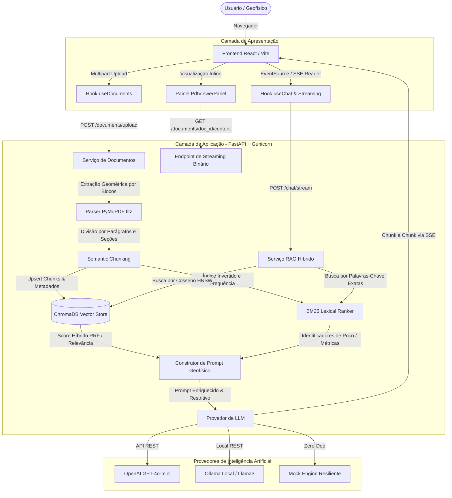
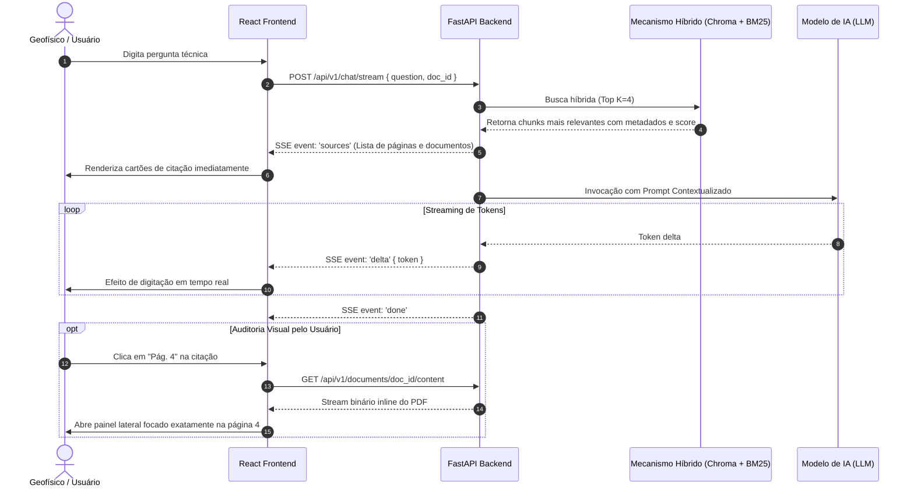

# 🏛️ Arquitetura do Sistema — GeoDoc AI

Este documento detalha o funcionamento arquitetural do **GeoDoc AI**, cobrindo o fluxo de dados, pipeline de **RAG Híbrido (Retrieval-Augmented Generation)**, estratégias de ingestão documental com **PyMuPDF**, ranking léxico **BM25**, concorrência com **Gunicorn** e o visualizador integrado lado a lado.

---

## 1. Visão Geral da Arquitetura

O sistema é baseado em uma arquitetura de serviços desacoplada:
* **Frontend SPA (React 18 + TypeScript):** Interface rica com visualização de PDFs lado a lado, citações de fontes com salto de página e consumo de respostas em streaming contínuo (SSE).
* **Backend API (Python 3.11 / FastAPI + Gunicorn):** Processamento assíncrono com 4 workers Uvicorn, extração em blocos com PyMuPDF, geração de embeddings, persistência vetorial e orquestração de LLMs.
* **Mecanismo RAG Híbrido:** Armazenamento vetorial com **ChromaDB** (espaço HNSW por cosseno) combinado com ranking léxico **BM25** para termos literais e códigos de poço.



---

## 2. Pipeline de Ingestão e Vetorização (RAG)

1. **Upload de Documentos:**
   - O usuário faz o upload de um relatório técnico em formato PDF (ex.: estudos sísmicos, dados de perfilagem ou relatórios de perfuração).
   - O arquivo é salvo de forma segura em `data/uploads/` com UUID gerado para auditoria.

2. **Extração Geométrica com PyMuPDF:**
   - O PyMuPDF (`fitz`) realiza a extração do texto por caixas delimitadoras e blocos (`page.get_text("blocks")`).
   - Isso garante que relatórios em 2 ou 3 colunas e tabelas de dados não tenham suas linhas truncadas ou lidas de forma cruzada.

3. **Chunking Semântico Estruturado:**
   - O particionamento respeita quebras de parágrafos (`\n\n`) e títulos, agrupando até 800 caracteres com overlap de 150 caracteres para preservar o contexto geológico contínuo.
   - Cada chunk recebe metadados estruturados:
     ```json
     {
       "doc_id": "a1b2c3d4",
       "filename": "relatorio_bacia_santos.pdf",
       "page": 4,
       "chunk_index": 12
     }
     ```

4. **Indexação Vetorial & Léxica:**
   - Os chunks são enviados ao `ChromaDB` sob uma coleção HNSW com distância por cosseno e paralelamente registrados no ranker `BM25`.

---

## 3. Fluxo de Consulta e Streaming (SSE)



---

## 4. Estratégia de Resiliência

* **Mock Mode:** Caso não haja conexão ativa com a internet ou credenciais da OpenAI/Ollama, a aplicação alterna automaticamente para o modo de simulação contextual geofísica, permitindo demonstrar 100% da interface e dos fluxos em entrevistas técnicas e testes locais.
* **SSE Fallback:** Se a conexão de streaming for bloqueada por proxies corporativos, o frontend recorre automaticamente ao endpoint REST síncrono.
* **AbortController:** O usuário pode interromper a geração a qualquer momento ou clicar em "Tentar novamente" em caso de instabilidade.

---

## 📚 Documentação Complementar

* [Documentação Técnica Completa](documentacao_completa.md)
* [Referência Completa da API REST](api_reference.md)
* [Guia de Estratégia para a Entrevista Técnica](guia_entrevista.md)
* [Guia de Conteinerização e Docker](docker_guide.md)
