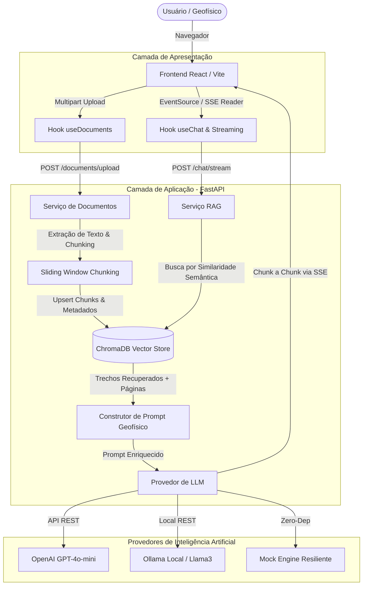
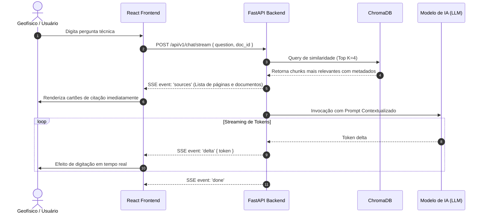

# 🏛️ Arquitetura do Sistema — GeoDoc AI

Este documento detalha o funcionamento arquitetural do **GeoDoc AI**, cobrindo o fluxo de dados, pipeline de **RAG (Retrieval-Augmented Generation)**, estratégias de ingestão documental e integração Fullstack.

---

## 1. Visão Geral da Arquitetura

O sistema é baseado em uma arquitetura de serviços desacoplada:
* **Frontend SPA (React + TypeScript):** Interface rica com visualização de PDFs, citações de fontes e consumo de respostas em streaming contínuo.
* **Backend API (Python / FastAPI):** Processamento assíncrono de documentos, geração de embeddings, persistência vetorial e orquestração de LLMs.
* **Vector Store (ChromaDB):** Armazenamento indexado com cálculo de similaridade por cosseno em espaço HNSW.



---

## 2. Pipeline de Ingestão e Vetorização (RAG)

1. **Upload de Documentos:**
   - O usuário faz o upload de um relatório técnico em formato PDF (ex.: estudos sísmicos, dados de perfilagem ou relatórios de perfuração).
   - O arquivo é salvo de forma segura em `data/uploads/` com UUID gerado para auditoria.

2. **Extração e Chunking com Janela Deslizante:**
   - `pypdf` realiza a extração do texto página a página.
   - O texto é particionado com tamanho fixo (800 caracteres) e overlap (150 caracteres), preservando termos geológicos contínuos (ex.: *velocidade intervalar sísmica*, *horizontes refletores*, *arenitos turbidíticos*).
   - Cada chunk recebe metadados estruturados:
     ```json
     {
       "doc_id": "a1b2c3d4",
       "filename": "relatorio_bacia_santos.pdf",
       "page": 4,
       "chunk_index": 12
     }
     ```

3. **Indexação Vetorial:**
   - Os chunks são enviados ao `ChromaDB` sob uma coleção HNSW configurada com distância por cosseno.

---

## 3. Fluxo de Consulta e Streaming (SSE)



---

## 4. Estratégia de Resiliência

* **Mock Mode:** Caso não haja conexão ativa com a internet ou credenciais da OpenAI/Ollama, a aplicação alterna automaticamente para o modo de simulação contextual geofísica, permitindo demonstrar 100% da interface e dos fluxos em entrevistas técnicas e testes locais.
