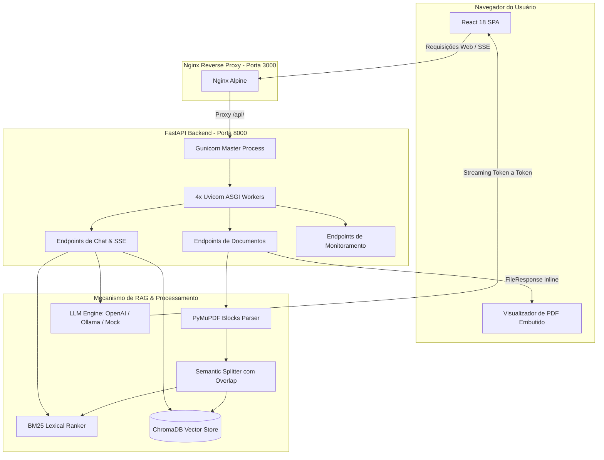

# 📖 GeoDoc AI — Documentação Técnica Completa

Bem-vindo à documentação oficial do **GeoDoc AI**. Este documento foi elaborado para detalhar o funcionamento arquitetural, os algoritmos de busca semântica e léxica, as decisões de engenharia e os procedimentos operacionais da plataforma.

---

## 📑 Índice
1. [Visão Geral e Contexto de Negócio](#1-visão-geral-e-contexto-de-negócio)
2. [Arquitetura Geral do Sistema](#2-arquitetura-geral-do-sistema)
3. [Pipeline de Dados e RAG Híbrido](#3-pipeline-de-dados-e-rag-híbrido)
   - [3.1 Ingestão e Parsing com PyMuPDF](#31-ingestão-e-parsing-com-pymupdf)
   - [3.2 Chunking Semântico Estruturado](#32-chunking-semântico-estruturado)
   - [3.3 Armazenamento Vetorial (ChromaDB)](#33-armazenamento-vetorial-chromadb)
   - [3.4 Ranking Léxico (BM25 Nativo)](#34-ranking-léxico-bm25-nativo)
   - [3.5 Orquestração de Provedores de LLM](#35-orquestração-de-provedores-de-llm)
4. [Camada de Apresentação (Frontend React)](#4-camada-de-apresentação-frontend-react)
   - [4.1 Streaming em Tempo Real via Server-Sent Events (SSE)](#41-streaming-em-tempo-real-via-server-sent-events-sse)
   - [4.2 Visualizador de PDF Lado a Lado Integrado](#42-visualizador-de-pdf-lado-a-lado-integrado)
   - [4.3 Gestão de Estado e Hooks Customizados](#43-gestão-de-estado-e-hooks-customizados)
5. [Camada de Aplicação (Backend FastAPI)](#5-camada-de-aplicação-backend-fastapi)
   - [5.1 Concorrência com Gunicorn e Workers Uvicorn](#51-concorrência-com-gunicorn-e-workers-uvicorn)
   - [5.2 Validações Preventivas Fail-Fast com Pydantic v2](#52-validações-preventivas-fail-fast-com-pydantic-v2)
6. [Ambiência, DevOps e Conteinerização (Docker)](#6-ambiência-devops-e-conteinerização-docker)
7. [Guia de Instalação e Execução Passo a Passo](#7-guia-de-instalação-e-execução-passo-a-passo)
8. [Qualidade de Software e Testes Automatizados](#8-qualidade-de-software-e-testes-automatizados)

---

## 1. Visão Geral e Contexto de Negócio

Nas indústrias de **Energia, Mineração e Óleo & Gás**, relatórios técnicos (como levantamentos sísmicos 2D/3D, perfis de poço, análises estratigráficas e relatórios ambientais) contêm centenas de páginas repletas de terminologias densas, dados tabulares e diagramas complexos.

### O Problema
1. **Lentidão na busca:** Geocientistas perdem horas procurando medições pontuais (ex.: *velocidade intervalar na camada de sal*, *porosidade de rochas microbiais*).
2. **Layouts que quebram ferramentas simples:** Documentos técnicos utilizam textos em 2 ou 3 colunas, tabelas de medição e cabeçalhos repetitivos que são corrompidos por parsers lineares comuns (como `pypdf`).
3. **Alucinação de modelos genéricos:** LLMs públicas consultadas sem contexto inventam dados numéricos e não fornecem a rastreabilidade da página de onde o dado foi extraído.

### A Solução
O **GeoDoc AI** une **Engenharia de Software de Alto Nível** com **IA Generativa Auditável**. Ele atua como um copiloto técnico que não apenas responde às dúvidas em linguagem natural, mas fornece o cartão de citação com **o trecho exato e a página de referência**, abrindo o documento PDF sincronizado na tela para validação imediata do engenheiro.

---

## 2. Arquitetura Geral do Sistema

A aplicação é dividida em microsserviços conteinerizados via **Docker Compose**:



---

## 3. Pipeline de Dados e RAG Híbrido

O coração do GeoDoc AI é o seu fluxo de **RAG Híbrido (Retrieval-Augmented Generation)**, construído para aliar recall semântico e precisão léxica.

### 3.1 Ingestão e Parsing com PyMuPDF
Ao receber um PDF em `POST /api/v1/documents/upload`, o sistema utiliza a biblioteca **PyMuPDF (`fitz`)**, escrita em C++ de alta performance:
* Método: `page.get_text("blocks")`
* **Vantagem técnica:** Extrai os blocos textuais a partir de suas coordenadas geométricas na página (`x0, y0, x1, y1`). Dessa forma, relatórios estruturados em duas colunas são lidos ordenadamente de cima para baixo na coluna esquerda e depois na coluna direita, sem intercalar frases de colunas vizinhas.
* **Resiliência:** Se a biblioteca C++ não estiver disponível, o sistema aciona automaticamente um fallback baseado em `pypdf`.

### 3.2 Chunking Semântico Estruturado
Em vez de uma divisão fixa de caracteres que corta termos geológicos ao meio, o [`document_service.py`](file:///home/esdrasfelipe/ProjetoIA/backend/app/services/document_service.py) aplica:
1. Separação inicial por quebra dupla de linha (`\n\n`), respeitando parágrafos e títulos.
2. Agrupamento de parágrafos até o limite de **800 caracteres**.
3. Se um parágrafo exceder o limite, aplica-se uma janela deslizante com **overlap de 150 caracteres**, garantindo que nenhum termo geológico complexo (ex.: *velocidade intervalar de 4500 m/s*) fique isolado do seu sujeito.
4. Metadados estruturados injetados em cada fragmento:
   ```json
   {
     "doc_id": "7a8b9c0d",
     "filename": "estudo_sismico_bs500.pdf",
     "page": 3,
     "chunk_index": 7
   }
   ```

### 3.3 Armazenamento Vetorial (ChromaDB)
Os fragmentos são persistidos em um banco de vetores **ChromaDB** configurado com indexação baseada em grafos **HNSW** (*Hierarchical Navigable Small World*):
* Métrica de distância: **Similaridade por Cosseno** ($1.0 - \text{distância}$).
* Os embeddings transformam cada texto em um vetor denso no hiperespaço, permitindo que perguntas como *"quais os horizontes refletores identificados?"* encontrem passagens que discutem *"mapeamento de refletores sísmicos e evaporitos"*, mesmo sem coincidência exata de palavras.

### 3.4 Ranking Léxico (BM25 Nativo)
Para atender às particularidades da engenharia e da geofísica (onde os usuários buscam códigos específicos como *"Poço 1-GEO-01-SPS"* ou *"óleo de 29° API"*), implementamos um ranker nativo baseado no algoritmo clássico **BM25 ($k_1=1.5, b=0.75$)** no [`rag_service.py`](file:///home/esdrasfelipe/ProjetoIA/backend/app/services/rag_service.py).
* A fórmula de pontuação pondera a Frequência do Termo (TF) normalizada pelo comprimento do documento em relação à média do corpus, combinada com o inverso da frequência nos documentos (IDF):
  $$\text{Score}(D, Q) = \sum_{i=1}^{n} \text{IDF}(q_i) \cdot \frac{f(q_i, D) \cdot (k_1 + 1)}{f(q_i, D) + k_1 \cdot \left(1 - b + b \cdot \frac{|D|}{\text{avgdl}}\right)}$$
* Isso garante que termos raros e identificadores de equipamentos/poços recebam o peso máximo na recuperação.

### 3.5 Orquestração de Provedores de LLM
O [`llm_service.py`](file:///home/esdrasfelipe/ProjetoIA/backend/app/services/llm_service.py) atua como uma camada agnóstica de inteligência:
* **Provedor OpenAI:** Conexão com `gpt-4o-mini` para alta precisão em nuvem.
* **Provedor Ollama:** Conexão HTTP direta com daemon local (ex.: `llama3`, `mistral`), permitindo operação 100% isolada e sem envio de dados para fora da rede corporativa.
* **Provedor Mock:** Engine simulador que gera respostas contextualizadas em geofísica sem custos nem dependência de chaves de API, ideal para demonstrações e testes em CI/CD.

---

## 4. Camada de Apresentação (Frontend React)

O Frontend foi concebido para fornecer uma experiência fluida e moderna, desenvolvida com **React 18**, **TypeScript**, **Tailwind CSS** e **Vite**.

### 4.1 Streaming em Tempo Real via Server-Sent Events (SSE)
Em vez de esperar 5 a 10 segundos para receber a resposta completa em um JSON estático, o frontend consome a rota `/api/v1/chat/stream`:
* O protocolo SSE utiliza HTTP persistente unidirecional.
* **Ordem de eventos transmitidos:**
  1. `event: sources` ➔ Envia imediatamente o array de citações e páginas encontradas, renderizando os cartões de auditoria antes mesmo do texto começar.
  2. `event: delta` ➔ Transmite os tokens conforme são emitidos pela LLM, alimentando o cursor de digitação em tempo real.
  3. `event: done` ➔ Sinaliza a conclusão do fluxo.
* **Resiliência:** O hook [`useChat.ts`](file:///home/esdrasfelipe/ProjetoIA/frontend/src/hooks/useChat.ts) suporta cancelamento via `AbortController` (botão "Parar resposta"), botão de "Tentar novamente" em caso de timeout e fallback automático para requisições REST tradicionais caso a rede do usuário bloqueie streaming.

### 4.2 Visualizador de PDF Lado a Lado Integrado
O componente [`PdfViewerPanel.tsx`](file:///home/esdrasfelipe/ProjetoIA/frontend/src/components/Documents/PdfViewerPanel.tsx) divide a tela do navegador:
* Ao clicar na tag de página de uma citação (*"Pág. 2"*), o visualizador abre na lateral direita posicionado diretamente na página referenciada (`#page=2&view=FitH`).
* Permite paginação manual, abertura em nova aba e fechamento com um clique, transformando a interface em um painel completo de auditoria técnica.

---

## 5. Camada de Aplicação (Backend FastAPI)

### 5.1 Concorrência com Gunicorn e Workers Uvicorn
Para suportar múltiplos usuários simultâneos sem travar a aplicação durante o upload de PDFs pesados, o [`Dockerfile`](file:///home/esdrasfelipe/ProjetoIA/backend/Dockerfile) de produção utiliza:
```bash
gunicorn app.main:app -w 4 -k uvicorn.workers.UvicornWorker -b 0.0.0.0:8000 --timeout 120
```
* O **Gunicorn Master Process** monitora a integridade dos workers e distribui a carga por 4 processos assíncronos Uvicorn independentes.

### 5.2 Validações Preventivas Fail-Fast com Pydantic v2
O módulo [`config.py`](file:///home/esdrasfelipe/ProjetoIA/backend/app/core/config.py) implementa o princípio *Fail-Fast*:
* Caso a aplicação seja configurada com `LLM_PROVIDER="openai"` mas a variável `OPENAI_API_KEY` esteja vazia, o Pydantic aborta a inicialização com uma mensagem clara, evitando que erros silenciosos apareçam apenas quando o usuário final fizer uma consulta.

---

## 6. Ambiência, DevOps e Conteinerização (Docker)

O projeto disponibiliza duas estratégias de orquestração com **Docker Compose**:

### Produção ([`docker-compose.yml`](file:///home/esdrasfelipe/ProjetoIA/docker-compose.yml))
* **Frontend:** Multi-stage build com Node 20 para compilação e Nginx Alpine para entrega estática minificada e proxy reverso.
* **Backend:** Imagem `python:3.11-slim`, executada sob usuário sem privilégios de root (`appuser`), com limites de consumo de recursos (`memory: 2048M`) e `HEALTHCHECK` ativo.
* **Rede Interna:** Bridge isolada `geodoc_network`.

### Desenvolvimento ([`docker-compose.dev.yml`](file:///home/esdrasfelipe/ProjetoIA/docker-compose.dev.yml))
* Mapeamento de volumes direto do código do repositório (`./backend` e `./frontend`).
* **Hot-Reload:** Alterações em arquivos Python ou TypeScript refletem no navegador em milissegundos sem necessidade de reiniciar os containers.

---

## 7. Guia de Instalação e Execução Passo a Passo

### Opção A: Execução Imediata com Docker (Recomendado)
```bash
# 1. Clone o repositório
git clone https://github.com/esdrasfelipe07/geodoc-ai.git
cd geodoc-ai

# 2. Inicie todos os serviços
docker compose up --build
```
* **Frontend:** Acesse [http://localhost:3000](http://localhost:3000)
* **Documentação Interativa Swagger:** Acesse [http://localhost:8000/docs](http://localhost:8000/docs)

### Opção B: Execução Local para Desenvolvimento
```bash
# 1. Backend (Python)
cd backend
python -m venv .venv
source .venv/bin/activate  # No Windows: .venv\Scripts\activate
pip install -r requirements-dev.txt
cp .env.example .env
uvicorn app.main:app --reload --port 8000

# 2. Frontend (React em outro terminal)
cd ../frontend
npm install
npm run dev
```

---

## 8. Qualidade de Software e Testes Automatizados

O backend conta com uma suíte de testes com `pytest` cobrindo o ciclo de vida completo:
* [`test_health.py`](file:///home/esdrasfelipe/ProjetoIA/backend/tests/test_health.py): Verificação de integridade e metadados da API.
* [`test_documents.py`](file:///home/esdrasfelipe/ProjetoIA/backend/tests/test_documents.py): Validação de tipos de arquivo, extração de páginas, listagem, visualização binária inline e exclusão de índices.
* [`test_chat.py`](file:///home/esdrasfelipe/ProjetoIA/backend/tests/test_chat.py): Validação de esquemas Pydantic, geração RAG e integridade dos eventos de streaming SSE.

Para executar os testes automatizados dentro do Docker:
```bash
docker compose run --rm backend pytest -v
```
Ou localmente:
```bash
cd backend && pytest -v
```
